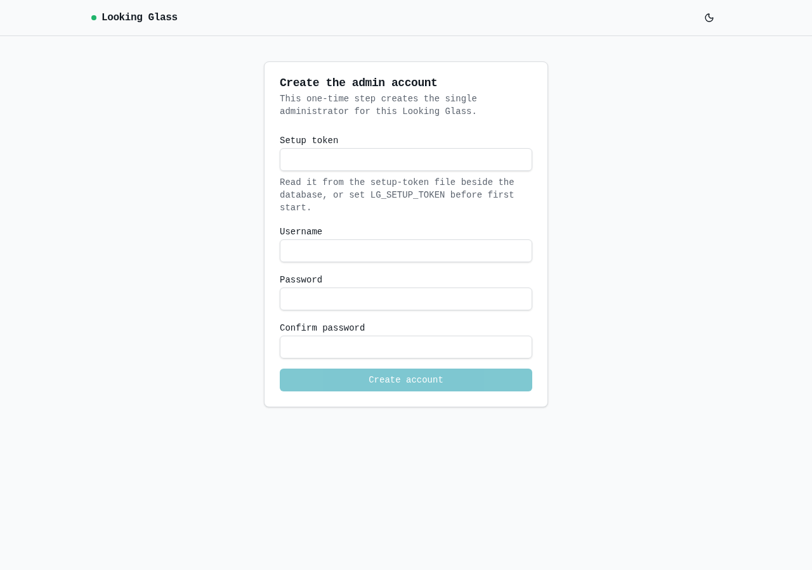

# Looking Glass

A self-hosted network diagnostics console. The central container serves the web UI,
stores state in one mounted directory, runs diagnostics on its built-in local node,
and coordinates enrolled remote agents over an outbound tunnel.



The screenshot above is captured from the running application. Browser proof for the
populated public diagnostics page is recorded in `.devrites/work/looking-glass/browser-evidence.md`.

## Install the central container

The central app needs one writable volume for the redb database, local test files,
and the generated first-run setup token. It also needs a publicly reachable HTTPS
name for the admin API and a direct HTTPS listener for the outbound agent tunnel.

Prepare a certificate whose subject/SAN covers the public name you will use below.
For a quick local smoke test, replace `lg.example.net` with the name in your test
certificate and generate a test pair with OpenSSL:

```sh
mkdir -p tls
openssl req -x509 -newkey rsa:2048 -sha256 -nodes -days 30 \
  -subj '/CN=lg.example.net' \
  -addext 'subjectAltName=DNS:lg.example.net' \
  -keyout tls/looking-glass.key -out tls/looking-glass.crt
sudo chown 999:999 tls/looking-glass.key
chmod 600 tls/looking-glass.key
```

The published-image path becomes available only after Slice 39 publishes the planned
immutable `v0.1.1` release:

```sh
LG_IMAGE=ghcr.io/viktorsbaikers/looking-glass:v0.1.1
docker pull "$LG_IMAGE"
```

Before publication, validate the same deployment from a checked-out source tree:

```sh
docker build -t looking-glass:local .
LG_IMAGE=looking-glass:local
```

Choose one image path above, then set `LG_PUBLIC_NAME` to the public DNS name covered
by your certificate and `LG_TRUSTED_PROXIES` to the real proxy-to-container source IP.
Its planned local URL/SHA-256 release metadata is not evidence that those assets are
published or verified. The following is the complete central start command:

```sh
LG_PUBLIC_NAME=lg.example.net
# Set this to the source IP the container sees for the TLS-terminating proxy.
LG_TRUSTED_PROXIES=SET_THE_REAL_PROXY_TO_CONTAINER_SOURCE_IP
LG_INSTALLER_URL=https://github.com/ViktorsBaikers/looking-glass/releases/download/v0.1.1/install-agent.sh
LG_INSTALLER_SHA256=d824313a58f19e937f5365b9f5db019e05ba5163e00ec6249513b118142a7880
LG_AGENT_URL=https://github.com/ViktorsBaikers/looking-glass/releases/download/v0.1.1/lg-agent-x86_64-unknown-linux-gnu
LG_AGENT_SHA256=9bb238a79847683432e9f20066b37ea1fbd027829ebb792d14fc983b6e9bb8c7
docker volume create looking-glass-data
docker run --rm --user 0 -v looking-glass-data:/data --entrypoint chown "$LG_IMAGE" -R 999:999 /data
docker run -d --name looking-glass \
  -p 8080:8080 \
  -p 8443:8443 \
  -v looking-glass-data:/data \
  -v "$PWD/tls/looking-glass.crt:/run/looking-glass/tls.crt:ro" \
  -v "$PWD/tls/looking-glass.key:/run/looking-glass/tls.key:ro" \
  -e LG_DB_PATH=/data/lookingglass.redb \
  -e LG_FILES_DIR=/data/files \
  -e LG_TRUSTED_PROXIES="$LG_TRUSTED_PROXIES" \
  -e LG_CENTRAL_URL="https://$LG_PUBLIC_NAME" \
  -e LG_TUNNEL_URL="https://$LG_PUBLIC_NAME:8443" \
  -e LG_CENTRAL_CERT=/run/looking-glass/tls.crt \
  -e LG_TUNNEL_CERT=/run/looking-glass/tls.crt \
  -e LG_TUNNEL_KEY=/run/looking-glass/tls.key \
  -e LG_AGENT_INSTALL_SCRIPT_URL="$LG_INSTALLER_URL" \
  -e LG_AGENT_INSTALL_SCRIPT_SHA256="$LG_INSTALLER_SHA256" \
  -e LG_AGENT_URL="$LG_AGENT_URL" \
  -e LG_AGENT_SHA256="$LG_AGENT_SHA256" \
  "$LG_IMAGE"
```

Put the web surface behind a TLS-terminating reverse proxy that forwards to port
8080. `LG_TRUSTED_PROXIES` must be the real source IP that container receives from
that proxy, not a client address or a copied example. The proxy must attest
`X-Forwarded-Proto: https`; admin login and agent enrollment are refused without
that trusted attestation. The HTTPS enrollment proxy must present the same leaf certificate configured at `LG_CENTRAL_CERT`; agents pin it when they enroll. Publish port 8443 directly so enrolled agents can reach the TLS/WebSocket tunnel at `LG_TUNNEL_URL`.

On first start, the app writes the one-time setup token beside the database:

```sh
docker exec looking-glass cat /data/setup-token
```

Enter that token on the installer page, create the single admin account, then remove
or restrict access to the token file. To provide the token yourself instead of
generating a file, set `LG_SETUP_TOKEN` before the first start.

## Remote agent install

The complete central command above configures the four planned release-asset values
required for enrollment-command generation. Central refuses to generate an enrollment
command if any URL or SHA-256 pin is missing or invalid. Remote installation works
only after Slice 39 publishes those exact `v0.1.1` assets and verifies the URL/SHA-256
values; before then, the generated command is not runnable against a remote release.

After the central container is healthy, finish first-run setup with the token, sign
in as the administrator, create a remote location, and use that location's
**Generate install command** action. Copy the resulting command to the Linux node;
do not invent or hand-edit its token. It embeds:

- the HTTPS central API origin (`LG_CENTRAL_URL`), used for `/api/enroll`;
- the HTTPS tunnel origin (`LG_TUNNEL_URL`), used after enrollment for the outbound agent tunnel;
- central's pinned identity fingerprint (`LG_CENTRAL_FP`);
- a single-use enrollment token (`LG_ENROLL_TOKEN`);
- the planned installer and agent release-asset URLs with SHA-256 pins, after Slice 39
  has published and verified them.

Run the generated command on the Linux node exactly as shown. It self-escalates
through `sudo` when pasted by a sudo-capable user, scrubs the root environment with
an explicit allowlist, downloads and verifies the installer from a root-owned temp
directory, then verifies the agent binary before installing it. The installer
consumes the enrollment token immediately, writes the issued long-lived agent
credential owner-only under `/var/lib/lookingglass-agent`, and writes a systemd
unit that does not contain the enrollment token. The location becomes connected
after its agent reaches the tunnel; an enrollment token cannot be reused.

The command-control tunnel is outbound from the agent to central. Speedtest downloads
and iperf endpoints are separate data-plane services: expose them directly from the
node only when you want that node to offer speedtest data.

## Runtime privileges

The installed agent runs as the non-root `lookingglass-agent` user. The agent binary
gets no ambient capability. Each diagnostic tool receives only the grant it needs:

- `ping`, `mtr`, and `traceroute` get `cap_net_raw+ep` on the exact executable the
  service user resolves from the service `PATH`.
- BGP is available only through a restricted wrapper in
  `LG_AGENT_BGP_WRAPPER_DIR`; the agent does not fall through to system `birdc` or
  `vtysh`.

If no scoped BGP wrapper is installed, BGP stays unavailable and fails closed with a
clear message.

`NoNewPrivileges=false` is deliberate so file capabilities survive `execve`. The
fixed argv templates and root-owned service `PATH` bound the reachable commands; do
not add arbitrary tools to that path.

## Configuration reference

| Variable | Applies to | Default | Notes |
| --- | --- | --- | --- |
| `PORT` | central | `8080` | HTTP listener inside the container. |
| `LG_DB_PATH` | central | `data/lookingglass.redb` | redb database path. In containers, mount this under a volume. |
| `LG_FILES_DIR` | central | `data/files` | Local-node downloadable test files root. |
| `LG_SETUP_TOKEN` | central | generated file | Optional first-run setup token. If unset, central writes `setup-token` beside `LG_DB_PATH`. |
| `LG_TRUSTED_PROXIES` | central | empty | Comma-separated proxy IPs trusted for client identity and TLS attestation. Empty fails closed for admin/enroll TLS checks. |
| `LG_CENTRAL_URL` | central | `https://localhost` | Plain HTTPS API origin that serves `/api/enroll`; no path/query/fragment. |
| `LG_TUNNEL_URL` | central | `https://localhost:8443` | Plain HTTPS tunnel origin embedded in agent install commands; no path/query/fragment. |
| `LG_CENTRAL_CERT` | central | unset | PEM certificate used as central API identity material for enrollment fingerprinting. |
| `LG_CENTRAL_IDENTITY` | central | ephemeral | Stable fallback identity material when `LG_CENTRAL_CERT` is not set. |
| `LG_TUNNEL_CERT` / `LG_TUNNEL_KEY` | central | unset | PEM cert/key for the direct agent TLS tunnel listener. If unset, remote agents cannot connect. |
| `LG_TUNNEL_BIND` | central | `0.0.0.0:8443` | Direct TLS/WebSocket tunnel bind address. |
| `LG_AGENT_INSTALL_SCRIPT_URL` | central | unset | HTTPS URL embedded in generated agent install commands. |
| `LG_AGENT_INSTALL_SCRIPT_SHA256` | central | unset | SHA-256 pin for the installer script. |
| `LG_AGENT_URL` | central | unset | HTTPS URL for the prebuilt agent binary release asset. |
| `LG_AGENT_SHA256` | central | unset | SHA-256 pin for the agent binary. |
| `LG_EXEC_MAX_CONCURRENT` | central | `8` | Global in-flight diagnostic cap per node. |
| `LG_EXEC_TIMEOUT_SECS` | central | `30` | Per-command timeout. |
| `LG_EXEC_MAX_OUTPUT_KIB` | central | `256` | Total output cap per command. |
| `LG_EXEC_RATE_MAX` | central | `20` | Per-client run attempts per window. |
| `LG_EXEC_RATE_WINDOW_SECS` | central | `60` | Per-client run rate window. |
| `LG_AGENT_CREDENTIAL` | agent | `data/agent-credential.json` | Stored credential path. The installer sets this in the unit. |
| `LG_AGENT_DATA_BIND` | agent | unset | Optional remote speedtest file server bind address. |
| `LG_AGENT_FILES_DIR` | agent | `data/files` | Remote speedtest files root when data plane is enabled. |
| `LG_AGENT_BGP_WRAPPER_DIR` | agent | installer wrapper dir | Scoped directory the agent probes for `birdc`/`vtysh`. |

Installer-only variables include `LG_AGENT_INSTALL_PATH`, `LG_AGENT_STATE_DIR`,
`LG_AGENT_SERVICE_FILE`, `LG_AGENT_USER`, `LG_AGENT_SERVICE_PATH`,
`LG_AGENT_BGP_WRAPPER`, and `LG_AGENT_BGP_DAEMON`. `LG_INSTALL_DRY_RUN=1` is for
local installer tests only.

## Release image

`.github/workflows/release.yml` builds the Dockerfile and publishes to GHCR on:

- tags matching `v*`;
- GitHub Releases published from repository tags matching `v*`;
- manual `workflow_dispatch` when `push=true`.

Manual dispatch with `push=false` runs the same build path without logging in or
pushing, which is the no-credential dry-run equivalent. Manual dispatch with
`push=true` is a credentialed GHCR publish from the selected ref. Actual GHCR
package visibility, repository permissions, and branch/tag protection are
operator-owned setup.

## Upgrade and rollback

1. Select an immutable image tag (for example `v0.1.1`), never `latest`, and pull it.
2. Stop the old central container.
3. Start the new image with the same mounted data volume, certificate/key mounts,
   and environment.
4. Verify `/health`, admin login, public location list, and one local diagnostic.

Rollback is the same process with the previous immutable image tag and the same
mounted volume. Before upgrading, keep a copy of the mounted data directory or redb
file:

```sh
docker stop looking-glass
docker run --rm -v looking-glass-data:/data -v "$PWD":/backup alpine \
  sh -c 'cp -a /data /backup/looking-glass-data-backup'
```

For remote agents, keep the previous agent release asset available until the central
upgrade is accepted. If an agent upgrade fails, reinstall with the previous generated
asset URL/checksum and the stored credential path; do not reuse an enrollment token.

## Develop and verify

The central binary embeds `frontend/build`, so build the SPA before Rust checks:

```sh
cd frontend && npm ci && npm run build && cd ..
cargo fmt --all -- --check
cargo clippy --all-targets -- -D warnings
cargo test --all
cargo build --release
docker build -t looking-glass .
```

`make verify` runs the frontend build, Rust formatting, clippy, tests, and release build.
CI runs the same checks on push and pull request; enable branch protection to make a red
result block merges.
